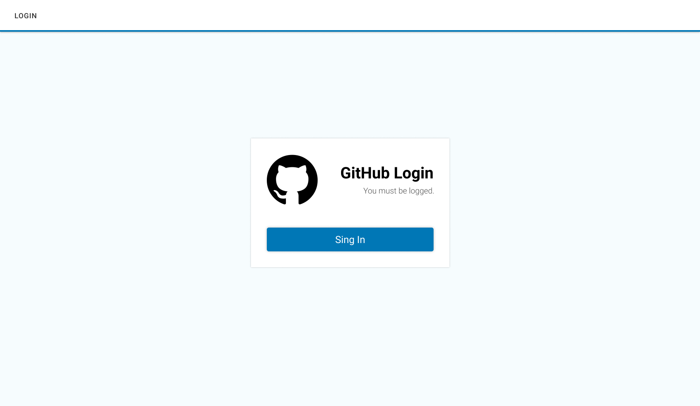
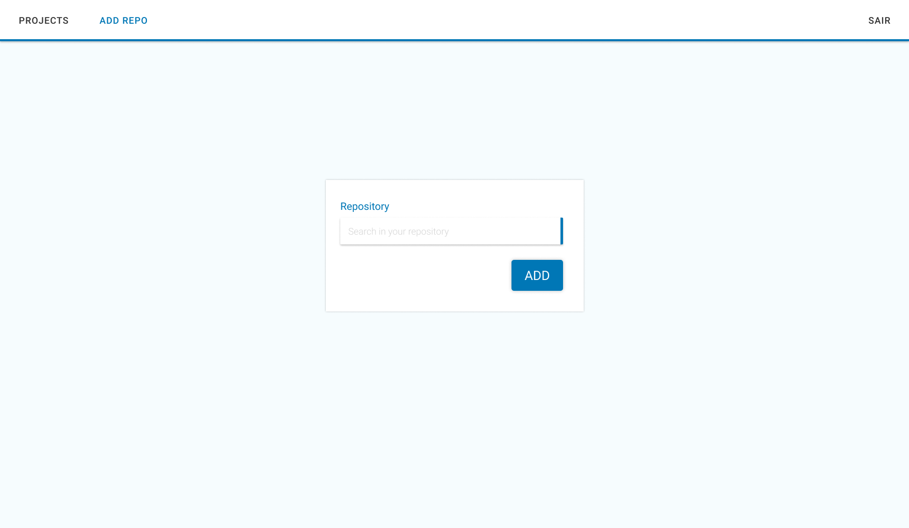
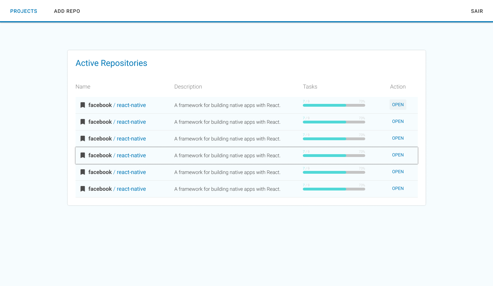
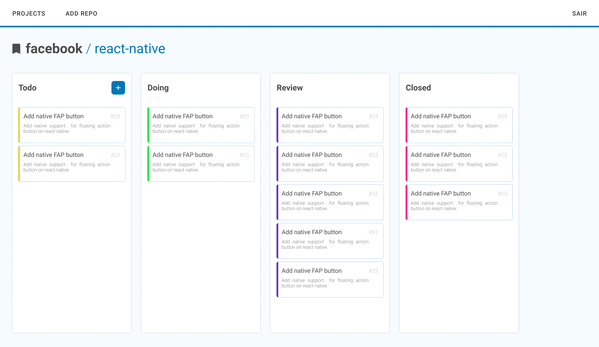
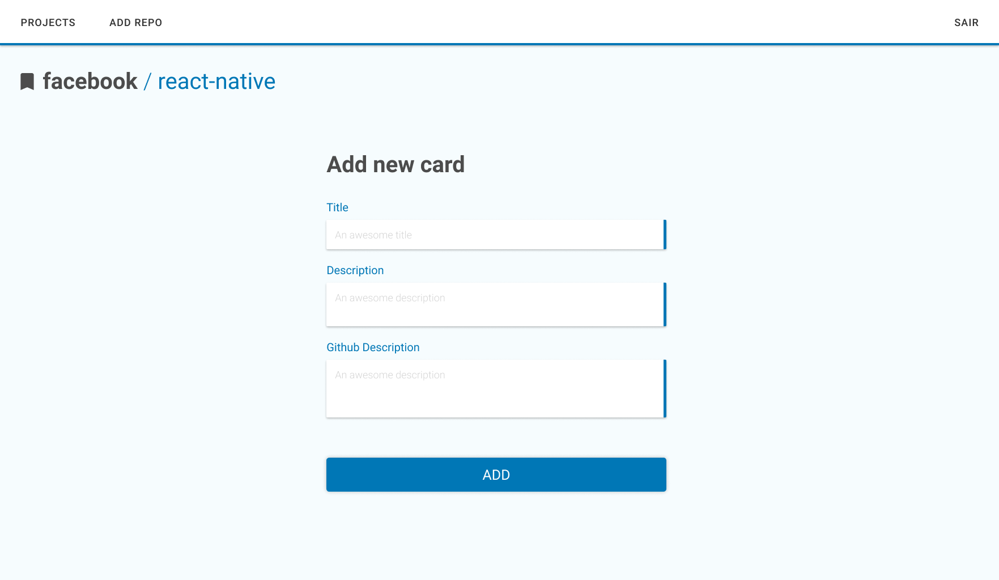
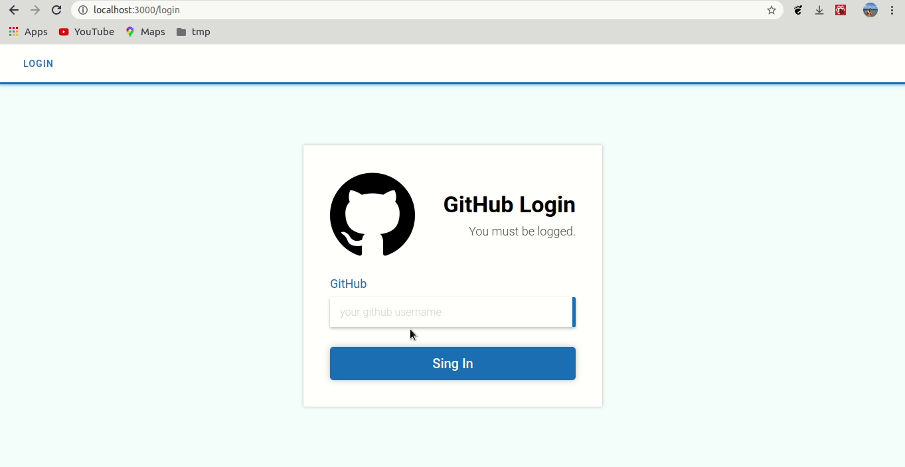
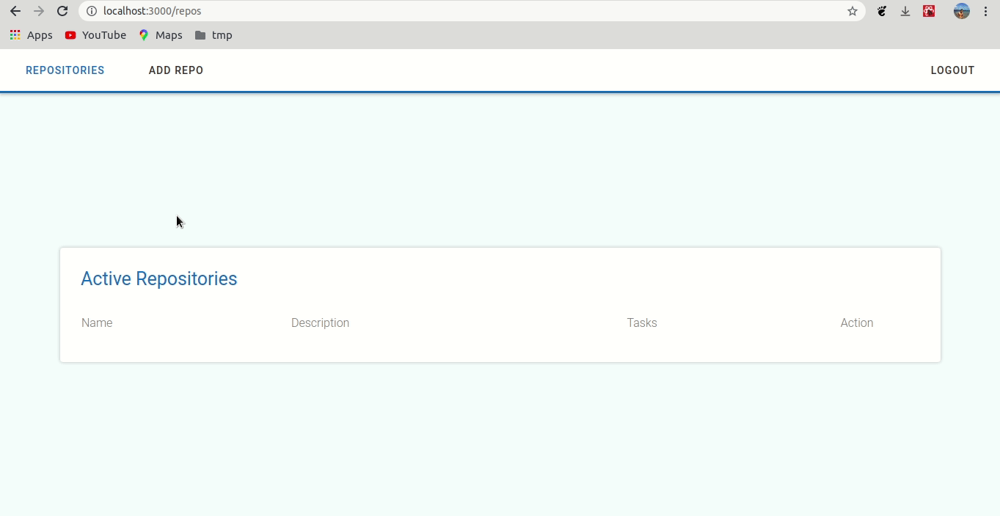
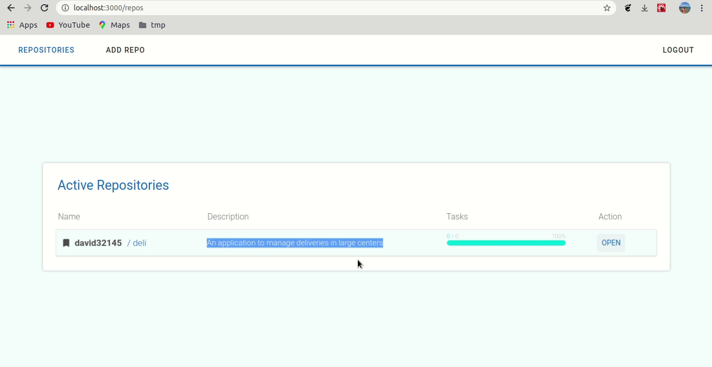
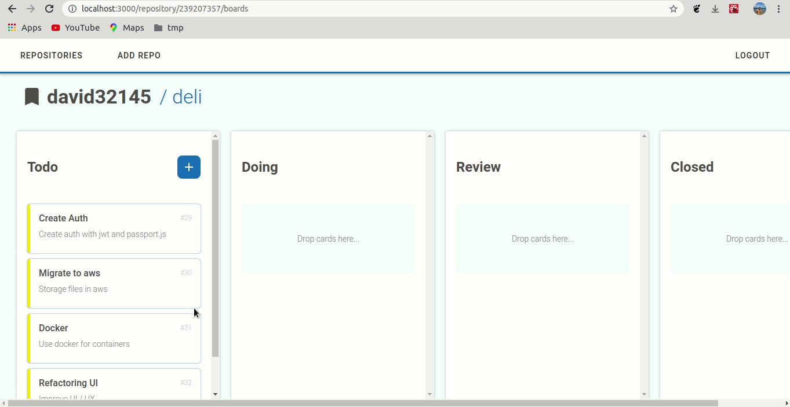

<h1 align="center">
  
</h1>

<p align="center">
  An application to manager github repository with kanban boards.
</p>

## 👨🏼‍💻 Development Contact

David Nascimento

- [Github](https://github.com/david32145)
- [nascimento32145@gmail.com](https://gmail.com)

## 🚶 User Stories

- [x] An user can be added an repository to system;
- [x] An user can select an repository and manager it;
- [x] The board kanban have 4 colums (**Todo**, **Doing**, **Review** and **Closed**);
- [x] **Todo** is the startpoint, that is, the user will create the _card/issues_ here;
- [x] Always an new card is created, an issue associate must be created;
- [x] The card can be title, description;
- [x] User can be drag and drop, of any board to any board:
- [x] When an user move card to **Closed** the associated issue must be closed;
- [X] When an user move card of **Closed** the associated issue must be reopen.

## 📝 Task List

- [x] Create figma prototype;
  - [x] Github login page;
  - [x] Add repository page;
  - [x] Select repository page;
  - [x] Kaban board;
  - [x] Add new **Todo** page.
- [x] Create front-end;
  - [x] Github login page;
  - [x] Add repository page;
  - [x] Select repository page;
  - [x] Kaban board;
  - [x] Add new **Todo** page.
- [x] Create back-end.
  - [x] create login resource;
  - [x] create add repository resource;
  - [x] create list repository resource;
  - [x] create card to an repository resource;
  - [x] create list boards of an repository resource.

## 🚀 Technologies

In the app was used an stack `javascript`, with `nodejs` in backend and `reactjs` in web.

### ♻️ Backend

- nodejs;
- typescript;
- eslint;
- dotenv;
- prettier;
- mysql;
- sequelize;
- axios;
- express;
- nodemon.

### 🌐 Web

- reactjs;
- typescript;
- eslint;
- prettier;
- react-dnd;
- styled-components;
- axios;
- react-router-dom;
- redux;
- react-redux;
- redux-saga;
- immer;

## 🎌 What I've learned

- OAuth with github;
- Create, search and delete database instances;
- Migrations with sequelize;
- Relationship in tables of database;
- API RESTful with express;
- Drag and drop of HTML5;
- Consumer the api resouces with axios;
- Manager github api resources;
- React hooks;
- React with redux;
- Side-effects with redux saga;
- Css-In-Js with styled-componets.

## 🏘️ Page Examples

### Login Page

<h1 align="left">
  
</h1>

### New Repo Page

<h1 align="left">
  
</h1>

### Repo List Page

<h1 align="left">
  
</h1>

### Repo Board Page

<h1 align="left">
  
</h1>

### New Card Page

<h1 align="left">
  
</h1>

## 🎥 How Usage

Example how usage app.

### ✔️ Login into GitHub

<h1 align="left">
  
</h1>

### 🆕 Add New Repository

<h1 align="left">
  
</h1>

### ✉️ Create Card / Issue

<h1 align="left">
  
</h1>

### 😍 Move Cards

<h1 align="left">
  
</h1>

## ✋🏻 Prerequisites

- [Node.js](https://nodejs.org/en/)
- [Yarn](https://yarnpkg.com/pt-BR/docs/install)
- [SQL Database](https://www.mysql.com/)
- [GitHub OAuth](https://github.com/settings/apps)

## 🔥 Install and Running

1. Config you environment;
2. Create an OAuth app in github;
3. Git clone `git clone https://github.com/david32145/github-kanban`;
4. Enter in api folder;
5. Copy .env.example to .env and fill with your config, sever port by default is 3333. Below an example of `.env`;
```env
DB_USER=root
DB_PASS=root
DB_HOST=localhost
DB_NAME=github_kanban
DB_PORT=3306
DB_DIALECT=mysql

FRONT_END_LOGIN_URL=http://localhost:3000/login

GITHUB_CLIENT_ID=your_github_client_id
GITHUB_CLIENT_SECRET=your_client_secret
```
6. Run `yarn install` or `npm install`;
7. Up your migrations with `yarn migration:up` or `npm run migration:up`;
8. Run server with `yarn dev` or `npm run dev`;
9. Enter in web folder;
10. Copy .env.example to .env and fill with your config. Below an example of `.env`

```env
REACT_APP_OPEN_CLIENT_ID=your_github_client_id
REACT_APP_API_URL=http://localhost:3333

```
11. Run server with `yarn dev` or `npm run dev`;
12. Run `yarn start` or `npm run start`;